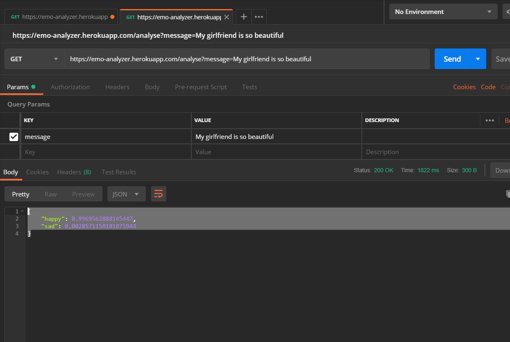

# Emotion Analyzer
> A Simple app that tells whether it is a positive statement or a negative one.

Emotion Analyzer analyzes a statement using a neural network that was built and trained using brain.js. 

## Installation
You can clone the repo -- git clone https://github.com/Hybeecodes/emotion-analyzer.git  OR click the download button

## Development Setup
After Installation,
cd emotion-analyzer
npm install

## Usage
The analyzer is exposed with an API endpoint:

url: /analyze?message=My girlfriend is so beautiful

response: {
    "happy": 0.0058226026594638824,
    "sad": 0.9941167831420898
}

## Meta

Your Name – [@Hybeecodes](https://twitter.com/Hybeecodes) – obikoya11@gmail.com

## Contributing

1. Fork it (<https://github.com/Hybeecodes/emotion-analyzer/fork>)
2. Create your feature branch (`git checkout -b feature/fooBar`)
3. Commit your changes (`git commit -am 'Add some fooBar'`)
4. Push to the branch (`git push origin feature/fooBar`)
5. Create a new Pull Request